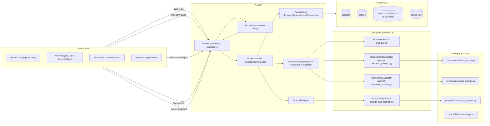
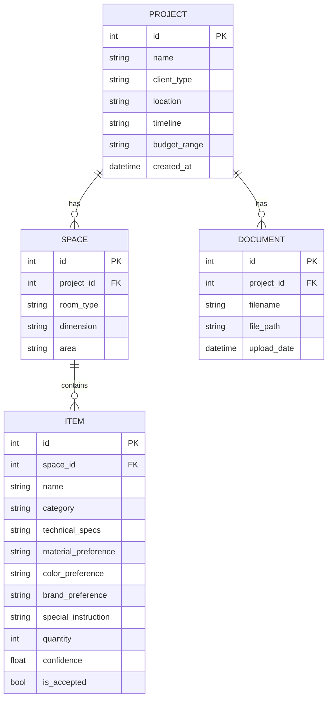

# Architecture

## Flow Description
- User logs in (JWT) via Streamlit. UI stores the token and includes it in all API calls.
- Upload triggers document save; analyze triggers parser → extractor → evaluator via orchestrator; results are persisted to Postgres.
- Users review spaces/items, edit fields, and accept/reject items; statuses and edits are saved.
- Prompt-based additions send user text to PromptAddAgent; outputs are merged into existing spaces or new ones.
- Exports (JSON/CSV) include only items marked accepted.

## ER Diagram

